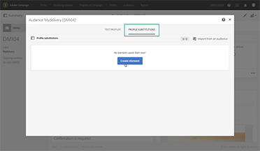
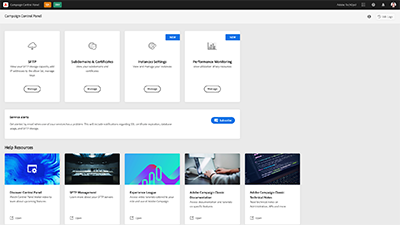
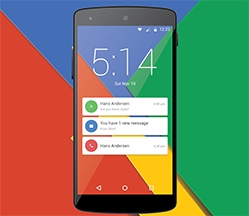

# Adobe Campaign Standard チュートリアル

Adobe Campaign は、クロスチャネルのカスタマーエクスペリエンスを設計するためのプラットフォームであり、視覚的なキャンペーンオーケストレーション、リアルタイムインタラクション管理およびクロスチャネル実行のための環境を提供します。このユーザーガイドには、Adobe Campaign Standard の数々の特長や機能に関するビデオとチュートリアルが含まれています。

## アドビのお勧め

<table>
<tr>
  <td>
    
    

      <a href="./communication-channels/email/profile-substitution.md">
    <strong>プロファイルの置き換え - ターゲットプロファイルを使用した E メールメッセージのテスト（ビデオ）</strong>
    </a>
    

    

    <em>プロファイルが受け取るメッセージの正確な表示内容を確認するために配達確認を送信する方法を説明します。</em>
    

  </td>
   <td>
    
    

    <a href="https://experienceleague.adobe.com/docs/control-panel-learn/tutorials/control-panel-overview.html?lang=ja">
    <strong>コントロールパネル（ビデオ）</strong>
    </a>
    

    

    <em> コントロールパネルでインスタンスの設定を管理し、使用状況を追跡することで、管理者の効率を向上させます。</em>
    

  </td>
  <td>
    
    

      <a href="https://experienceleague.adobe.com/docs/campaign-standard-learn/getting-started-with-push-notifications-android/introduction.html?lang=ja">
    <strong>チュートリアル：Android™ 向けプッシュ通知の概要</strong>
    </a>
    

    

    <em>このチュートリアルでは、プッシュ通知を Adobe Campaign から送信し Android™ アプリで受信する手順について説明します。</em>
    

  </td>
</tr>
</table>

