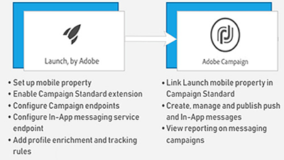

# 概要

Adobe Campaign は、クロスチャネルのカスタマーエクスペリエンスを構築するための基盤を提供し、視覚的なキャンペーンのオーケストレーションや、リアルタイムの対話管理、クロスチャネルのキャンペーン展開に必要な環境を提供します。このユーザガイドには、Adobe Campaign標準の多くの機能に関するビデオとチュートリアルが含まれています。

## 新機能

* **[外部APIアクティビティ](/help/managing-processes-and-data/data-management-activities/external-api-activity.md)**    
   *External APIアクティビティを使用してワークフローを設定および実行する方法について説明します。*

* **[プロファイルの置き換え — ターゲットプロファイルを使用した電子メールメッセージのテスト](/help/communication-channels/email/profile-substitution.md)**    
   *プロファイルが受け取るメッセージを正確に表示した状態で、レビュー用に配達確認を送信する方法を説明します。*

* **[コントロールパネル — Google TXTレコード管理](/help/administrating/control-panel/google-txt-record-management.md)**    
   *キャンペーンコントロールパネルを使用してGMAILアドレスに電子メールを送信するために使用するすべてのサブドメインに、Google TXTサイト検証レコードを追加する方法を説明します。*

* **[チュートリアル： Android向けプッシュ通知の概要](https://docs.adobe.com/content/help/en/campaign-standard-learn/getting-started-with-push-notifications-android/introduction.html)**    
   *このチュートリアルでは、Adobe Campaignからプッシュ通知を送信し、Androidアプリでこれらの通知を受信する手順について説明します。*

## スタッフの選考

<table>
<tr>
  <td>
    
    

      <a href="./communication-channels/mobile/in-app/in-app-message-overview.md">
    <strong>アプリ内メッセージ（チュートリアル）</strong>
    </a>
    

    

    <em>アプリ内メッセージは、モバイルアプリ内でユーザーがアクティブな場合にメッセージを表示できるチャネルです。</em>
    

  </td>
   <td>
    
    

      <a href="./designing-content/email-designer/email-designer-overview.md">
    <strong>電子メールデザイナ（ビデオ）</strong>
    </a>
    

    

    <em>電子メールデザイナーを使用すると、個々にパーソナライズされた電子メールを素早く簡単に視覚的に作成できます。</em>
    

  </td>
  <td>
    
    

      <a href="./designing-content/product-listings-in-transactional-email.md">
    <strong>製品リスト（チュートリアル）</strong>
    </a>
    

    

    <em>製品とサービスのリストを含むトランザクション電子メールを作成する。 </em>
    

  </td>
</tr>
</table>

## その他のリソース

* [ドキュメント](https://docs.adobe.com/content/help/ja-JP/campaign-standard/using/campaign-standard-home.html)
